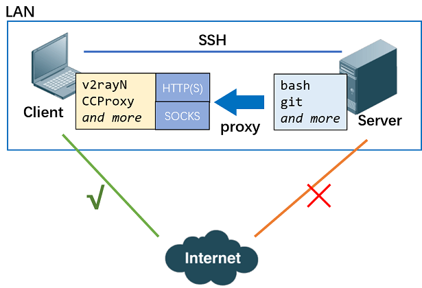
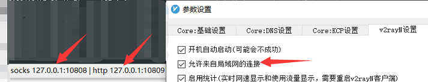

# quick-proxy-setup

本工具用于快速配置服务器上某些程序的代理设置。它设计的初衷是为通过配置到 SSH 客户端的代理，解决服务器连不上外网的问题，即如下图所示：



通过使用不同的配置，也可实现用其他代理服务器进行代理或二级代理的需求。

目前支持的被代理程序及要求 Client 提供的对应代理协议如下：

| 被代理程序                                 | Pipeline 类名  | HTTP 协议          | Socks 协议         |
| ------------------------------------------ | -------------- | ------------------ | ------------------ |
| bash <br>（可同时影响 wget，conda 等程序） | ProxyBash      | :heavy_check_mark: |                    |
| Git 的 HTTP 方式                           | ProxyGitHTTP   | :heavy_check_mark: |                    |
| SSH 方式的 GitHub 连接                     | ProxyGitHubSSH |                    | :heavy_check_mark: |

首先，配置 [recipe.json](./recipe.json)：

```
{
  "Network": {
    "IP": "<SSHClient>", // <SSHClient> 将被自动替换为建立的 SSH 连接的客户机，从而支持客户机是动态 IP 的情况，也可根据需求使用其他 IP
    "HTTPPort": 10809, // HTTP 代理端口
    "SocksPort": 10808 // Socks 代理端口
  },
  "Pipeline": { // 每个 Pipeline 类名所需要执行的动作列表，可用 init（初始化），proxy（代理），clear（清除），使用逗号分隔
    "ProxyBash": "init, proxy", // init 通常只需要执行一次，后续均替换为 proxy 即可
    "ProxyGitHTTP": "", // 为空则不做任何事
    "ProxyGitHubSSH": "init, proxy"
  }
}
```

然后运行：

```sh
python QuickProxySetup ./recipe.json
```

该工具不需要新安装任何第三方程序，也不需要 root 权限。对于对系统文件产生修改的，都会在对应目录预先生成以 `.ProxyToSSHClient.bak` 结尾的备份。但毕竟还是要改系统文件的，所以以防万一还是建议你手工备份一下 `~/.bashrc` 和 `~/.ssh/config`。

在客户机提供 HTTP 和 Socks 代理的方式有很多，可使用：

- [v2rayN](https://github.com/2dust/v2rayN)

  

- [CCProxy](https://www.youngzsoft.net/ccproxy/)

- ...

这样，外网断掉的服务器就可以通过 SSH 客户机或者其他代理服务器访问互联网了 **（本来就不该上外网的机器可不要这么做嗷，很危险）** ，并且有需要可以审计流量等。
